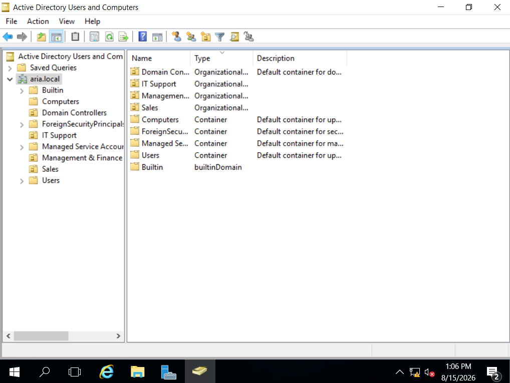
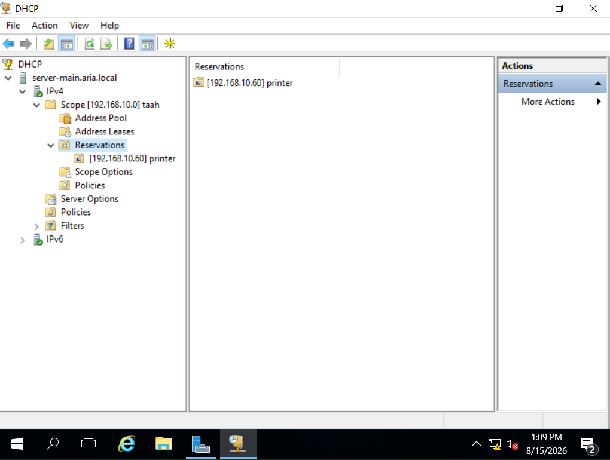
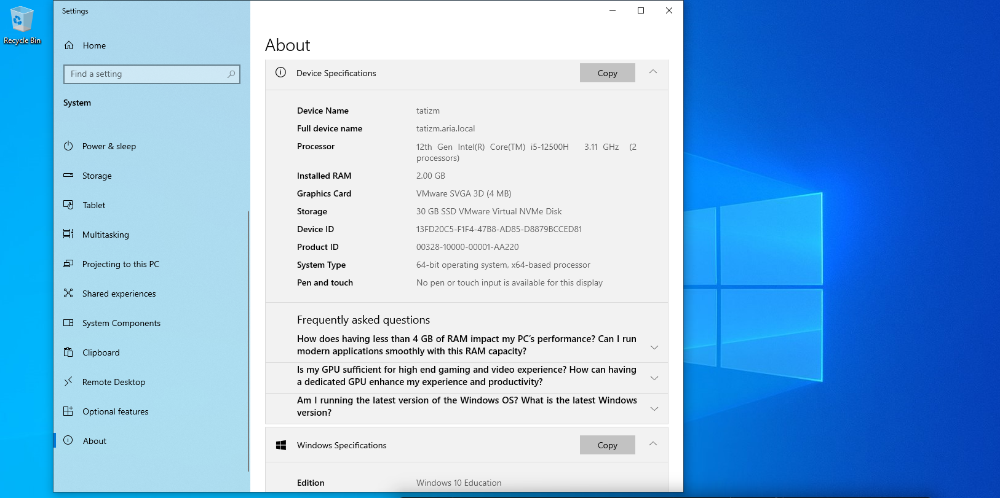
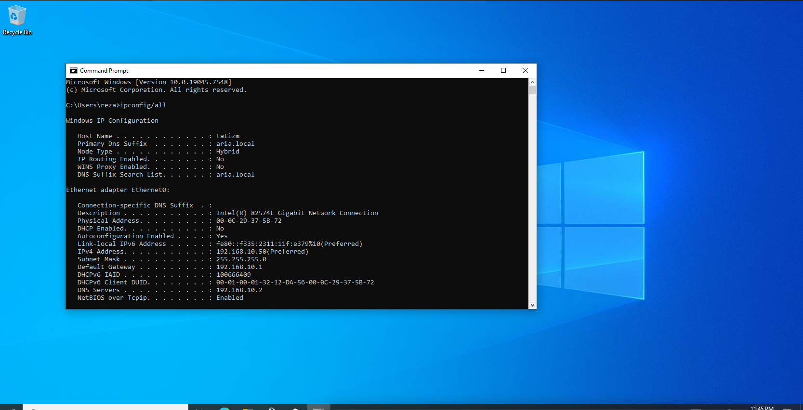
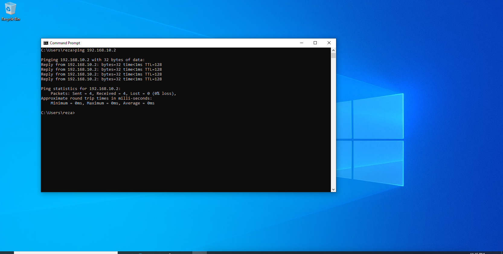

# 🖥️ Windows Server 2016 Infrastructure & Active Directory Lab

## 📌 Project Overview
This repository documents the full deployment, configuration, and troubleshooting of a virtual enterprise network infrastructure. The setup features a Windows Server 2016 Domain Controller integrated with a Windows 10 Enterprise client in an isolated virtual laboratory environment.

---

## 📐 Network Architecture & Topology

| Parameter | Configuration Detail |
| :--- | :--- |
| **Domain Name** | `aria.local` |
| **Domain Controller (DC)** | Windows Server 2016 (`192.168.10.2 /24`) |
| **Client Workstation** | Windows 10 Enterprise (`192.168.10.50 /24`) |
| **Installed Server Roles** | Active Directory Domain Services (AD DS), DNS, DHCP |
| **Virtualization Platform** | VMware Workstation (Isolated Host-Only `VMnet1`) |

---

## 🛠️ Key Implementations

- **Active Directory Domain Services (AD DS):** Configured domain structure `aria.local` and established custom Organizational Units (OUs) for enterprise structure management (`IT Support`, `Management & Finance`, `Sales`).
- **DHCP Server & Reservation:** Deployed active IPv4 Scope (`192.168.10.0/24`) and created static MAC-based IP reservations (e.g., Printer reservation at `192.168.10.60`).
- **Domain Integration:** Joined Windows 10 client (`tatizm.aria.local`) to the domain with verified DNS resolutions.

---

## 📸 Screenshots & Proof of Implementation

### 1. Active Directory Users & Computers Console
*Organizational Units (OUs) and Domain Hierarchy for `aria.local`:*

### 2. DHCP Scope & IP Reservation
*Active DHCP Scope with static IP reservation configured:*

### 3. Client System Properties
*Windows 10 client successfully joined to `aria.local`:*

### 4. Client Network Configuration (`ipconfig /all`)
*Verification of Domain Suffix, IP (`192.168.10.50`), and Preferred DNS (`192.168.10.2`):*

### 5. Network Connectivity Test
*Successful ICMP Echo Request pinging the Domain Controller:*

---

## 🔍 Troubleshooting Log & Isolated Issues

During initial configuration, the Windows 10 client experienced DHCP assignment failure, resulting in an APIPA address (`169.254.x.x`). 

### Root Cause Analysis & Resolution Steps:
1. **Network Layer Isolation:** Applied static IPv4 configuration on the client (`192.168.10.50`) with Domain Controller DNS (`192.168.10.2`) to establish layer-2/3 line-of-sight connectivity.
2. **Virtual Network Switch Adjustment:** Resolved VMware Workstation virtual network switch broadcast filtering by binding `VMnet1` strictly to the subnetwork (`192.168.10.0/24`).
3. **Domain Authentication Verification:** Successfully bound the host to `aria.local` domain and validated DC-to-client ICMP packets (`0% loss`).
